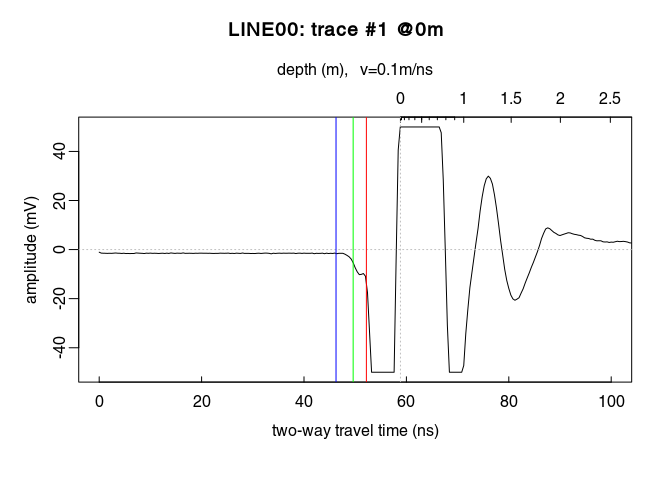
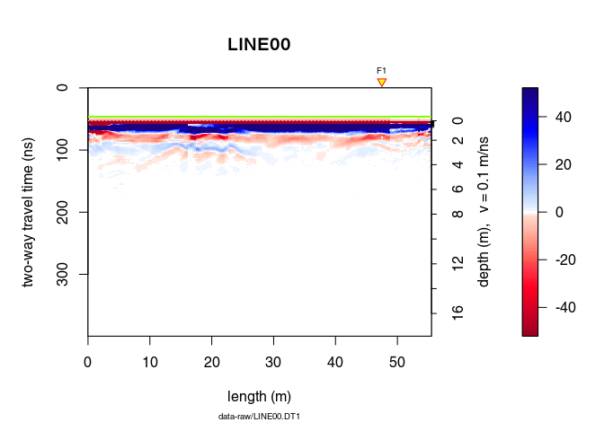

<!--
"/media/huber/Elements/UNIBAS/software/codeR/package_RGPR/RGPR-gh-pages/2014_04_25_frenke"
"G:/UNIBAS/software/codeR/package_RGPR/RGPR-gh-pages/2014_04_25_frenke"
-->

------------------------------------------------------------------------

**Note**:

-   This R-package is still in development, and therefore some of the functions may change in a near future.
-   If you have any questions, comments or suggestions, feel free to contact me (in english, french or german): <emanuel.huber@alumni.ethz.ch>.

Objectives of this tutorial
===========================

-   Learn how to use the pipe operator `%>%` to process elegantly GPR data.

Preliminary
===========

-   Read the tutorial [Basic GPR data processing](http://emanuelhuber.github.io/RGPR/01_RGPR_tutorial_basic-processing/) to learn more about the processing methods

Install/load `RGPR`
-------------------

``` r
# install "devtools" if not already done
if(!require("devtools")) install.packages("devtools")
devtools::install_github("emanuelhuber/RGPR")
library(RGPR)       # load RGPR in the current R session
```

The GPR data
------------

`RPGR` comes along with a GPR data called `frenkeLine00`. Because this name is long, we set `x` equal to `frenkeLine00`:

``` r
x <- frenkeLine00
plot(x)
```


Compute time zero
-----------------

``` r
tfb <- firstBreak(x, w = 10, method = "coppens", thr = 0.05)
plot(x[,1], relTime0 = FALSE, xlim = c(0, 100))
t0 <- firstBreakToTime0(tfb[1], x[,1])
abline(v = c(tfb[1], t0[1]), col = c("green", "blue"))
```



Using the pipe operators with RPGR
==================================

Basic piping
------------

Here a short excerpt of this webpage (<https://magrittr.tidyverse.org/>) that explains how to use `%>%`.

> The operators pipe their left-hand side values forward into expressions that appear on the right-hand side, i.e. one can replace `f(x)` with `x %>% f()`, where `%>%` is the pipe operator.

-   `x %>% f` is equivalent to `f(x)`
-   `x %>% f(y)` is equivalent to `f(x, y)`
-   `x %>% f %>% g %>% h` is equivalent to `h(g(f(x)))`

With pipe operators, the code is more compact and better readable.

The `%>%` pipe operator
-----------------------

`RGPR` exports the `%>%` pipe operator from the `magrittr` package.

Without pipe operator, we would code something like that:

``` r
time0(x) <- t0
x1 <- dcshift(x)
x2 <- dewow(x1, type = "MAD", w = 50)
x3 <- time0Cor(x2)
x4 <- fFilter(x3, f = c(100, 280), type = "low", plotSpec = FALSE)
x5 <- gain(x4, type = "agc", w =  5)
```

The same code with the `%>%` pipe operator.

``` r
xnew <- x %>%
  setTime0(t0) %>%
  dcshift() %>%
  dewow(type = "MAD", w = 50) %>%
  time0Cor() %>%
  fFilter(f = c(100, 280), type = "low", plotSpec = FALSE)  %>%
  gain(type = "agc", w =  5)
```

Note that we here the `setTime0()` instead of `time0()<-`. `setTime0()` is nothing else than a wrapper for `time0()<-`:

``` r
setTime0 <- function(x, t0){
  time0(x) <- t0
}
```

Currently, the other replace methods of `RGPR`(`function()<-`) do not have such a wrapper. Don't hesitate to write you own wrapper.

The `%T>%` tee operator
-----------------------

But what if you would like to plot the GPR data after the dewow filter? The function `plot()` does not return anything... The solution is to use the tee operator `%T>%` before `plot()`. `RGPR` exports the `%T>%` tee operator from the `magrittr` package.

> The tee operator works exactly like %&gt;%, but it returns the left-hand side value rather than the potential result of the right-hand side operations ([source](https://www.datacamp.com/community/tutorials/pipe-r-tutorial))

Here the example:

``` r
xnew <- x %>%
  setTime0(t0) %>%
  dcshift() %>%
  dewow(type = "MAD", w = 50) %T>%
  plot() %>%
  time0Cor() %>%
  fFilter(f = c(100, 280), type = "low", plotSpec = FALSE)  %>%
  gain(type = "agc", w =  5)
```



In this example `dewow(type = "MAD", w = 50) %T>%  plot()` returns the output of the `dewow()` function.
