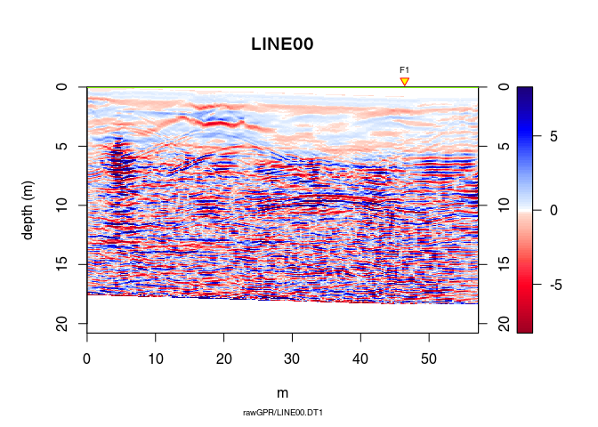
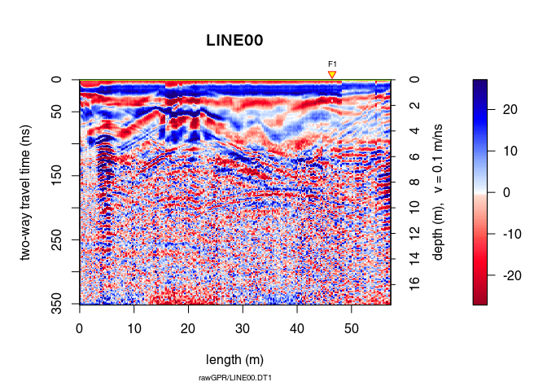
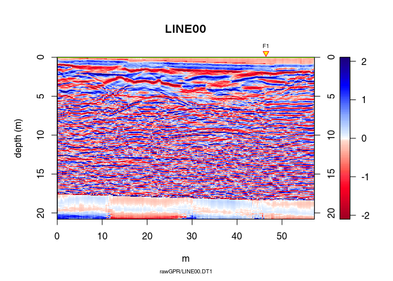

<!--
"/media/huber/Elements/UNIBAS/software/codeR/package_RGPR/RGPR-gh-pages/2014_04_25_frenke")
"G:/UNIBAS/software/codeR/package_RGPR/RGPR-gh-pages/2014_04_25_frenke"
-->

------------------------------------------------------------------------

**Note**:

-   This R-package is still in development, and therefore some of the functions may change in a near future.
-   If you have any questions, comments or suggestions, feel free to contact me (in english, french or german): <emanuel.huber@alumni.ethz.ch>.

Table of Contents
=================

-   [Objectives of this tutorial](#objectives-of-this-tutorial)
-   [Preliminary](#preliminary)
    -   [File organisation](#file-organisation)
    -   [Install/load `RGPR` and set the working directory](#installload-rgpr-and-set-the-working-directory)
-   [Read GPR data](#read-gpr-data)
-   [Pre-processing](#pre-processing)
    -   [Add topographic data (coordinates)](#add-topographic-data-coordinates)
    -   [DC shift removal](#dc-shift-removal)
    -   [First wave break estimation and set time-zero](#first-wave-break-estimation-and-set-time-zero)
    -   [Dewow](#dewow)
    -   [Frequency filter](#frequency-filter)
    -   [Time gain](#time-gain)
-   [Topographic Kirchhoff migration](#topographic-kirchhoff-migration)
    -   [Pre-processing](#pre-processing)
        -   [Constant offset correction](#constant-offset-correction)
        -   [Time upsampling (sinc-interpolation) of the GPR data to reduce the aliasing risk.](#time-upsampling-sinc-interpolation-of-the-gpr-data-to-reduce-the-aliasing-risk)
    -   [Topographic Kirchhoff migration.](#topographic-kirchhoff-migration)
    -   [Post-processing](#post-processing)
    -   [Comparison before/after migration](#comparison-beforeafter-migration)

Objectives of this tutorial
===========================

**Learn how to migrate GPR data.**

Note that his tutorial will not explain you the math/algorithms behind the different processing methods.

Preliminary
===========

-   Download the data [2014\_04\_25\_frenke.zip](http://emanuelhuber.github.io/RGPR/2014_04_25_frenke.zip)
-   Unzip the data

File organisation
-----------------

I suggest to organise your files and directories as follows:

    /2014_04_25_frenke   (project directory with date and location)
        /processing      (here you will save the processed GPR files)
        /rawGPR          (the raw GPR data, never modify them!)
        RGPR_tutorial.R  (this is you R script for this tutorial)

Install/load `RGPR` and set the working directory
-------------------------------------------------

-   Install and load the `RGPR`-package

    ``` r
    # install "devtools" if not already done
    if(!require("devtools")) install.packages("devtools")
    devtools::install_github("emanuelhuber/RGPR")
    library(RGPR)       # load RGPR in the current R session
    ```

-   Set the working directory:

    ``` r
    myDir <- "~/2014_04_25_frenke"  # adapt that to your directory structure
    setwd(myDir)    # set the working directory
    getwd()         # Return the current working directory (just to check)
    ```

Read GPR data
=============

``` r
A <- readGPR(fPath = "rawGPR/LINE00.DT1")   # the filepath is case sensitive!
```

    ## Warning in readGPR(fPath = "rawGPR/LINE00.DT1"): Use argument 'dsn' instead of
    ## 'fPath' because argument 'fPath' is deprecated.

Pre-processing
==============

Add topographic data (coordinates)
----------------------------------

We assume that for each GPR record there is a file containing the (x, y, z) coordinates of every traces. The header of these files is "E", "N", "Z" instead of "x", "y", "z" because in topography "x" sometimes designates the North ("N") and not the East ("E") as we would expect. The designation "E", "N", "Z" is less prone to confusion and therefore we chose it!

1.  Define the filepaths to the topo files:

``` r
TOPO <- file.path(getwd(), "coord/topo/LINE00.txt")
```

1.  Read all the files with the funciton `readTopo()` that creates a list whose elements correspond to the GPR record and contain all the trace coordinates:

``` r
TOPOList <- readTopo(TOPO, sep = "\t")
```

    ## read /mnt/data/RGPR/CODE/RGPR-gh-pages/2014_04_25_frenke/coord/topo/LINE00.txt...

1.  Set the list of coordinates as the new coordinates to the GPRsurvey object:

``` r
coord(A) <- TOPOList[[1]]
```

DC shift removal
----------------

Remove the DC-offset estimated on the first n samples usind the function `dcshift()`. This function takes as argument the `GPR` object and the sample index used to estimate the DC shift (in this case, the first 110 samples):

``` r
A1 <- dcshift(A, 1:110)   # new object A1
```

First wave break estimation and set time-zero
---------------------------------------------

The first wave break time, t\_{}, is estimated for each traces

``` r
tfb <- firstBreak(A1)   # take some time
```

Convert the first wave break time *t*<sub>*f**b*</sub> into time-zero *t*<sub>0</sub> with `firstBreakToTime0()`.

Here we define *t*<sub>0</sub> = *t*<sub>*f**b*</sub> − *a*/*c*<sub>0</sub>, where *a* is the distance between the transmitter and receiver and *c*<sub>0</sub> is the wave velocity in the media between the transmitter and receiver (in our case, air). The value *a*/*c*<sub>0</sub> corresponds to the wave travel time from the transmitter to the receiver.

``` r
t0 <- firstBreakToTime0(tfb, A1)
time0(A1) <- t0     # set time0 to A1
```

To shift the traces to time-zero, use the function `time0Cor`.

``` r
A2 <- time0Cor(A1, method = "spline")
```

Dewow
-----

Remove the low-frequency components (the so-called "wow") of the GPR record with:

``` r
A3 <- dewow(A2, type = "runmed", w = 50)
```

Frequency filter
----------------

Eliminate the high-frequency (noise) component of the GPR record with a bandpass filter. We define as corner frequencies at 150 *M**H**z* and 260 *M**H**z*, and set `plotSpec = TRUE` to plot the spectrum with the signal, the filtered signal and the filter.

``` r
A4 <- fFilter(A3, f = c(150, 260), type = "low", plotSpec = TRUE)
```


Time gain
---------

Apply a power gain and a spherical gain to compensate for geometric wave spreading and attenuation (Kruse and Jol, 2003; Grimm et al., 2006).

``` r
A5 <- gain(A4, type = "power", alpha = 1, te = 150, tcst = 20)
A6 <- gain(A5, type = "exp", alpha = 0.11, t0 = 0, te = 125)
```

Topographic Kirchhoff migration
===============================

See *Dujardin & Bano (2013, Topographic migration of GPR data: Examples from Chad and Mongolia, Comptes Rendus Géoscience, 345(2):73-80. Doi: 10.1016/j.crte.2013.01.003)*

Pre-processing
--------------

### Constant offset correction

Time correction for each trace to compensate the offset between transmitter and receiver antennae (it converts the trace time of the data acquired with a bistatic antenna system into trace time data virtually acquiered with a monostatic system)

``` r
A7 <- timeCorOffset(A6)
plot(A7)
```


### Time upsampling (sinc-interpolation) of the GPR data to reduce the aliasing risk.

``` r
A8 <- upsample(A7, n = c(3,1))
```

Topographic Kirchhoff migration.
--------------------------------

Vertical resolution of the migrated data: `dz = 0.01`m.

Dominant frequency from `spec(A9)`: `fdo = 80` MHz (used to estimate the Fresnel zone).

For the moment the algorithm works **only with a constant radar wave velocity**. In this example the velocity is:

``` r
vel(A8)         # velocity
```

    ## [1] 0.1

``` r
depthunit(A8)   # units: nano-second (ns)
```

    ## [1] "ns"

To change the velocity, simply do:

``` r
vel(A8)  <- 0.09        # velocity in ns
```

``` r
A9 <- migration(A8, type="kirchhoff", max_depth = 20,
                 dz = 0.01, fdo = 80)
plot(A9)
```



You don't see so much: we need some post-processing!

Post-processing
---------------

Trace smoothing with a Gaussian filter

``` r
A10 <- filter1D(A9, type = "Gaussian", w = 2.5)
```

Automatic gain control

``` r
A11 <- gain(A10, type = "agc", w = 0.55)
```

inverse normal transformations

``` r
A12 <- traceScaling(A11, type = "invNormal")
```

Comparison before/after migration
---------------------------------

Before migration

``` r
plot(traceScaling(A8, type = "invNormal"))
```



After migration

``` r
plot(A12)
```


